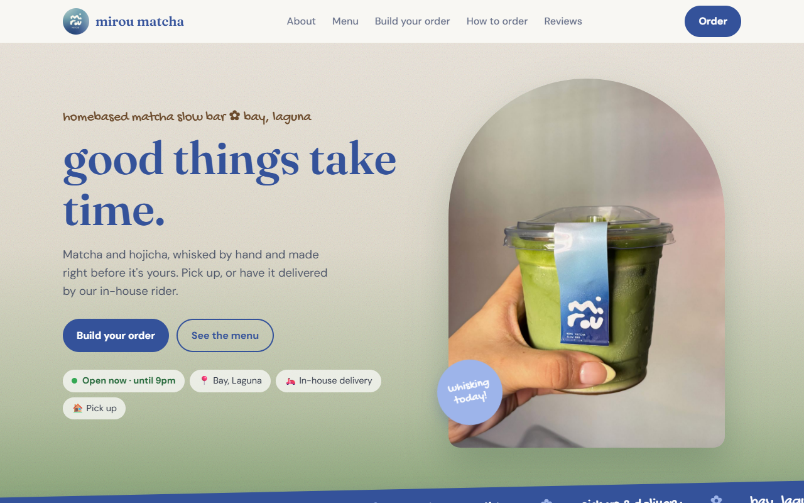
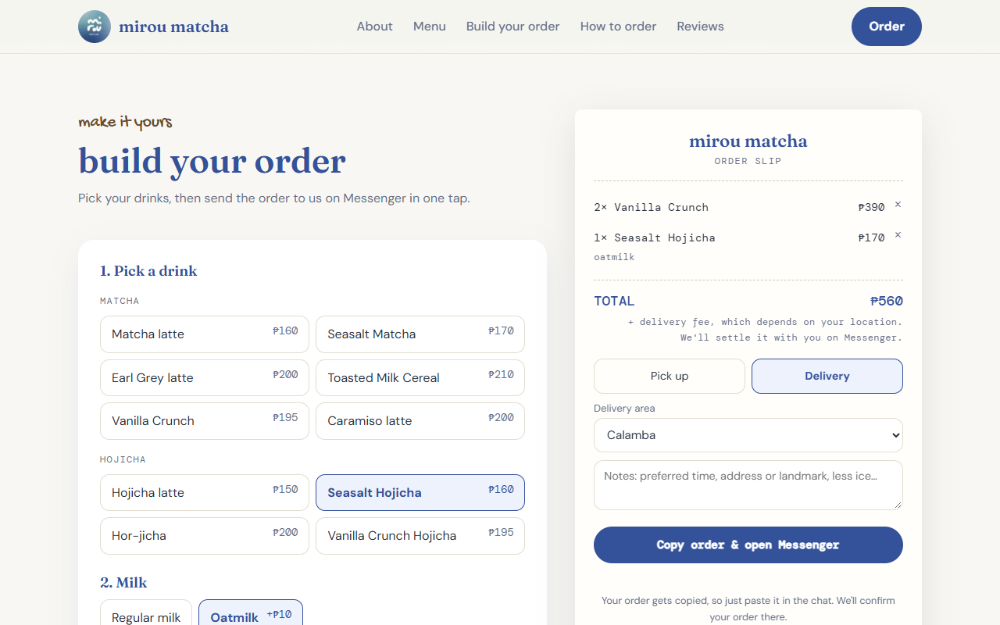
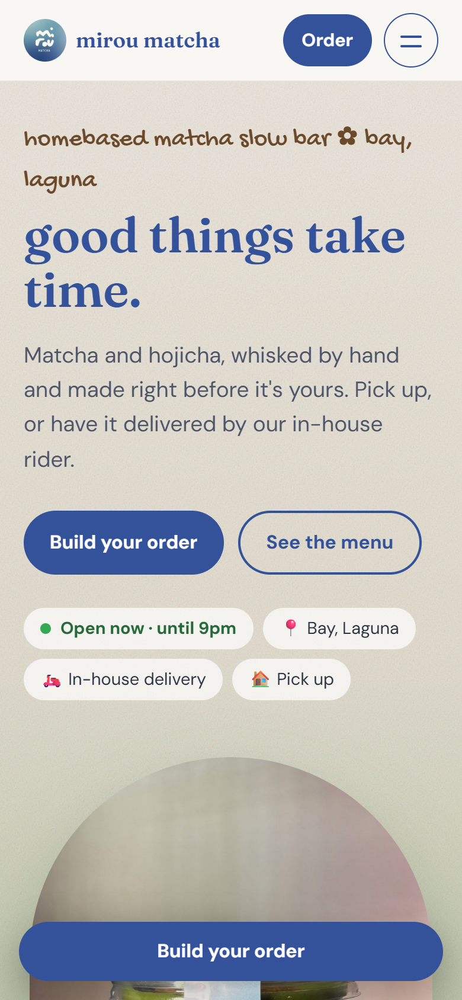
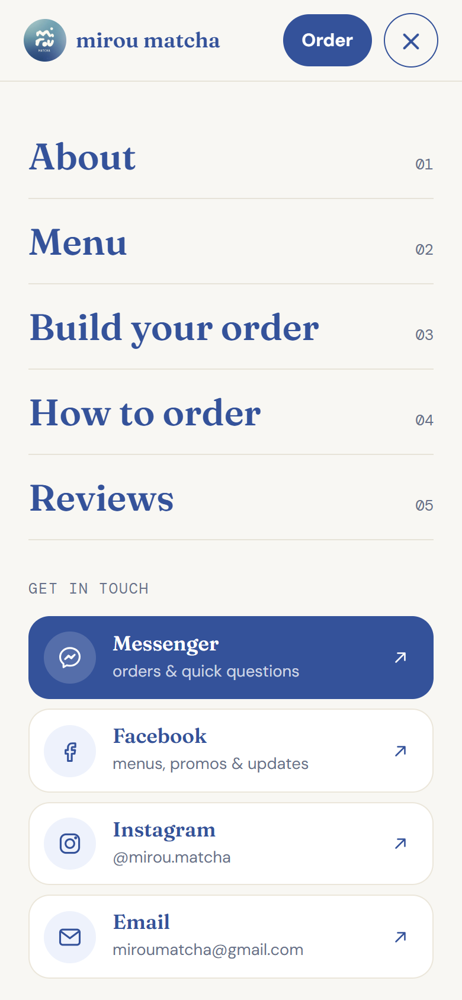

# mirou matcha

Website for **mirou matcha**, a home-based matcha slow bar in Bay, Laguna, Philippines.
Customers can browse the menu, build an order, check if their town is in the delivery area, and send the order on Messenger in one tap.

**Live site:** https://dionanthonyflores-prog.github.io/mirou-matcha/



| Order builder | On a phone | Phone menu |
| --- | --- | --- |
|  |  |  |

## What it does

- **Menu with matcha and hojicha tabs.** Every drink card has a "+ order this" button that jumps to the order builder with that drink already picked.
- **Order builder.** Pick a drink, regular milk or oatmilk (+₱10), and how many. The order slip keeps a running total, joins repeat drinks into one line, and remembers the order if the page is refreshed.
- **Send on Messenger.** "Copy order & open Messenger" copies a ready-made order message (drinks, total, pick up or delivery, notes) and opens the shop's Messenger chat.
- **Delivery checker.** Tap or type a town to see if it's in the delivery area. It understands typing without accents ("Los Banos") and local nicknames ("UPLB", "Elbi"). Towns outside the list get an "ask us on Messenger" link.
- **"Open now" badge.** Shows *Open now*, *Closing soon* (last 30 minutes) or *Closed*, always in Philippine time, even if the visitor's phone is set to another time zone.
- **Photo viewer.** Review and gallery photos open large on the same page. Works with arrow buttons, the keyboard, or swiping on a phone.
- **Phone menu.** A full-screen menu that closes when a link is tapped or Esc is pressed.
- **Accessible.** Photos have descriptions, everything works with a keyboard, and animations turn off for visitors who set "reduce motion" on their device.
- **Share preview.** Links shared on Facebook or Messenger show a picture card instead of a plain link.

## How it's built

- One file, `index.html`, with the HTML, CSS and JavaScript together. No framework and no build step.
- The only outside pieces are Google Fonts and [Lenis](https://github.com/darkroomengineering/lenis) for smooth scrolling.
- The prices and delivery towns each live in one list in the script (`DRINKS` and `AREAS`), so the menu, order builder and delivery checker always agree.
- Hosted for free on GitHub Pages.

## Run it on your computer

You need [Node.js](https://nodejs.org) installed.

```bash
git clone https://github.com/dionanthonyflores-prog/mirou-matcha.git
cd mirou-matcha
node scripts/serve.js
```

Then open http://localhost:5174 in your browser.

## Testing

A QA case study for this site is in progress: test plan, test cases, automated Playwright tests on desktop and phone sizes, and a defect log.

## Credits

Website built and tested by Dion Anthony Flores.

The photos, logo, menu and customer reviews belong to mirou matcha and are shared here as a portfolio piece. Please don't reuse them.
