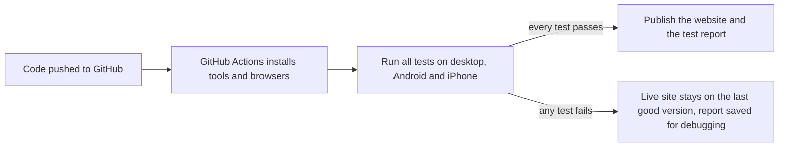

# QA case study: mirou matcha

[](https://github.com/dionanthonyflores-prog/mirou-matcha/actions/workflows/tests.yml)

How the [mirou matcha website](https://dionanthonyflores-prog.github.io/mirou-matcha/), a real ordering site for a home-based matcha bar, is tested: planning, test design, automation, CI and bug reporting.

| At a glance | |
| --- | --- |
| Requirements covered | **16**, each traced to its tests |
| Automated test cases | **54**: 81 tests × 3 devices = **243 runs** (228 apply, all pass; 15 skipped on purpose) |
| Devices | Desktop Chrome, Android phone (Chromium), iPhone (WebKit) |
| Manual test cases | **8**, for real phones, photos, Messenger and Facebook |
| Bugs found and fixed | **5** (1 Major, 3 Minor, 1 Trivial), each with before/after evidence |
| Runs | On every push to GitHub. The site is only published if every test passes. |

**Read more:** [Test plan](test-plan.md) · [Test cases and traceability](test-cases.md) · [Defect log](defect-log.md) · [Latest test report](https://dionanthonyflores-prog.github.io/mirou-matcha/report/) · [Test code](../tests)

## What was tested

The site lets customers browse the menu, build an order, check delivery to their town and send the order on Messenger. The highest risk is anything touching the order and the money, so the order builder has the most tests: totals, quantity limits, saved orders and the exact Messenger message. Navigation, photos, the opening-hours badge, accessibility basics and security basics are covered too. See the [test plan](test-plan.md#2-scope).

## How

- **End-to-end automation with Playwright and TypeScript.** A real browser taps through the site like a customer would, using what a customer sees (button names, labels) rather than hidden code details.
- **Three devices for every test:** desktop Chrome, an Android phone and an iPhone (Safari's WebKit engine). Phone-only features, like the ☰ menu and swiping, are tested on phones only.
- **A fake clock** tests the "Open now" badge at exact moments (11:59, 12:00, 20:29, 20:30, 21:00) and for visitors whose phones are set to other time zones, without waiting for real time to pass.
- **Real touch input** tests swiping in the photo viewer, after a mouse-based test proved misleading (see below).
- **Test design techniques:** boundary values, equivalence classes (11 ways to type a town), a decision table (pick up vs delivery), state transitions and error guessing (damaged saved data, script-like input).
- **Evidence for every test:** the [test report](https://dionanthonyflores-prog.github.io/mirou-matcha/report/) has a video and a final-screen picture for each of the 228 runs, passed or failed. Failures also keep a step-by-step trace.
- **External sites are replaced with a stand-in page,** so tests never send anything to Messenger, Facebook or Instagram.
- **Traceability:** every test name starts with its test-case ID and is tagged with its requirement and any bug it guards, for example `TC-11 … @REQ-04 @BUG-002`.

## How the automation runs



This is a **quality gate**: broken code cannot reach customers. The workflow is in [`.github/workflows/tests.yml`](../.github/workflows/tests.yml).

## Results

| ID | Bug | Severity | How it was found |
| --- | --- | --- | --- |
| BUG-001 | White patch over the cup in a menu photo | Minor | Manual visual check |
| BUG-002 | One drink could go past the 20-cup limit, then silently shrink after a reload (₱6,400 became ₱3,200) | **Major** | Code review, then a script |
| BUG-003 | On phones, the menu's "Reviews" link landed about 440px short | Minor | Automated check of the live site |
| BUG-004 | A quick second tap on the menu tabs was ignored | Minor | Automated test |
| BUG-005 | "clear order" showed on an empty order slip | Trivial | Automated test |

Full reports, with steps, root causes, fixes and screenshots, are in the [defect log](defect-log.md).

**Change request CR-01.** During an exploratory session, a 60-cup order raised the question of what the limit really was. The rule turned out to allow 40 of the same drink (20 regular plus 20 oatmilk) while the message said 20 was the most. When asked, the owner said the 20-cup limit was never her rule: she takes orders of any size. The limit was raised to 99 per drink (only to catch typing mistakes), customers can now type the quantity, and the affected tests were updated. See [Changes to the requirements](test-plan.md#changes-to-the-requirements).

## Highlights

- **The regression tests are proven to catch their bugs.** The BUG-002 and BUG-003 tests were run against the old, buggy version of the site. They failed there, and only where the real bug was: the "Reviews" link failed while the other 4 menu links passed. They pass on the fixed version.
- **Real bugs were told apart from test problems.** Eight failures turned out to be test or tooling issues, such as lazy-loaded photos, a mouse drag versus a finger swipe, and a test that tapped faster than any person could. Each was investigated and fixed in the test, not hidden. See [Investigated, not a bug](defect-log.md#investigated-not-a-bug).
- **Flaky tests aren't tolerated.** A test that only failed sometimes was traced to its cause, fixed, and then repeated 5 times on each device (15/15 passed) before it was trusted. An independent run also caught a test running too close to its time limit, so every test's run time was checked against its limit.
- **Evidence first.** After BUG-001 (where no "before" screenshot was kept), every bug had its evidence captured before the fix.
- **Requirements get questioned, not just tested.** The 20-cup limit passed every test, because the tests checked what the code did. Only asking the owner showed it was never a business rule (CR-01).

## What's next

- Run the 8 manual test cases on a real Android phone and a real iPhone.
- Add an automated accessibility scan (axe-core) to catch colour-contrast and labelling issues.
- Schedule a daily test run against the live site, so a problem with an outside service (fonts, smooth-scrolling library) is noticed even when nobody pushes code.

## Run the tests yourself

You need [Node.js](https://nodejs.org).

```bash
npm install
npx playwright install chromium webkit
npm test
```

To open the report afterwards, run `npm run test:report`. To test the live site instead of a local copy:

```bash
BASE_URL=https://dionanthonyflores-prog.github.io/mirou-matcha/ npx playwright test
```

## How this was made

This project was built with [Claude Code](https://claude.com/claude-code), an AI coding assistant, as a pair programmer. Commits it helped with are marked `Co-Authored-By: Claude`. I set the goals and rules, reviewed the results, reproduced findings in my own browser, and made the decisions, such as fixing the bugs on the live site before writing up the case study.
