# Defect log

Seven real bugs were found and fixed. Each fix has its own commit, and each bug except BUG-001 has an automated regression test that was seen to **fail on the buggy code and pass on the fixed code**.

Severity and priority are defined in the [test plan](test-plan.md#6-bug-reporting).

| ID | Summary | Severity | Priority | Found by | Status | Fix | Regression test |
| --- | --- | --- | --- | --- | --- | --- | --- |
| [BUG-001](#bug-001) | White patch covers part of the cup in the Seasalt Hojicha photo | Minor | High | Manual visual check | Closed | Photo re-prepared | MT-01 (manual) |
| [BUG-002](#bug-002) | The same drink can go past the 20-cup limit, then silently drops back to 20 after a reload | Major | High | Code review, then a script | Closed | [`385480c`](https://github.com/dionanthonyflores-prog/mirou-matcha/commit/385480c) | TC-11, TC-14 |
| [BUG-003](#bug-003) | On phones, the menu's "Reviews" link lands about 440px short on a first visit | Minor | Medium | Automated check of the live site | Closed | [`c3c66f8`](https://github.com/dionanthonyflores-prog/mirou-matcha/commit/c3c66f8) | TC-36 |
| [BUG-004](#bug-004) | A quick second tap on the menu tabs is ignored | Minor | Medium | Automated test TC-03 | Closed | [`c23eaae`](https://github.com/dionanthonyflores-prog/mirou-matcha/commit/c23eaae) | TC-03 |
| [BUG-005](#bug-005) | "clear order" link shows on an empty order slip | Trivial | Low | Automated test TC-08 | Closed | [`f676ea1`](https://github.com/dionanthonyflores-prog/mirou-matcha/commit/f676ea1) | TC-08 |
| [BUG-006](#bug-006) | On short phone screens the menu cannot be scrolled, so Email is cut off | Minor | High | Manual check on a real phone (Galaxy S24 Ultra) | Closed | [`1b1f0ee`](https://github.com/dionanthonyflores-prog/mirou-matcha/commit/1b1f0ee) | TC-37, MT-03 |
| [BUG-007](#bug-007) | With the phone menu open, "Order" and the logo in the header do nothing | Minor | Medium | Manual check on a real phone (Galaxy S24 Ultra) | Closed | [`1b1f0ee`](https://github.com/dionanthonyflores-prog/mirou-matcha/commit/1b1f0ee) | TC-34 |

---

## BUG-001

**White patch covers part of the cup in the Seasalt Hojicha photo**

| | |
| --- | --- |
| Severity / priority | Minor / High. The site still works, but the photo is of a best-selling drink, on the menu every customer sees. |
| Found | 29 Sep 2026, during a visual review of the menu (local preview) |
| Fixed | 29 Sep 2026 |
| Status | Closed |

**Steps to reproduce**
1. Open the site and go to the menu.
2. Tap the **hojicha** tab.
3. Look at the **Seasalt Hojicha** card.

**Expected:** the cup is shown whole, like the other drinks.
**Actual:** a white, paper-coloured patch covers part of the cup's rim near the top-left.

**Root cause:** the menu photos are cut out of the shop's own menu-board image. The handwritten "best seller" note sits just above and to the left of this cup, and a bit of the lettering came along when the cup was cut out. A paper-coloured patch was painted over the letters, but it was too big and overlapped the cup's rim.

**Fix:** the patch was shrunk to cover only the leftover letters, the cup was cut out again from the original menu image, and it was sharpened again.

**Verification:** visual check of the new photo at full size on desktop and phone. Current photo: [`images/menu-seasalt-hojicha.jpg`](../images/menu-seasalt-hojicha.jpg).

**Evidence:** no "before" screenshot was kept. *Lesson learned:* every later bug had its evidence captured **before** fixing it.

**Why there is no automated test:** judging whether a photo "looks right" is far cheaper for a person than for a script. It is covered by manual test MT-01, a visual check of every photo after any photo change.

---

## BUG-002

**The same drink can go past the 20-cup limit, then silently drops back to 20 after a reload**

| | |
| --- | --- |
| Severity / priority | Major / High. The customer's order and total change without warning. |
| Found | 1 Oct 2026, by reading the order-builder code, then confirmed with a Playwright script |
| Environment | Desktop Chrome and Edge (local preview). The logic is the same on every device. |
| Fixed | 2 Oct 2026, [`385480c`](https://github.com/dionanthonyflores-prog/mirou-matcha/commit/385480c) |
| Status | Closed |

**Steps to reproduce**
1. In "build your order", pick **Matcha latte** and press **+** until the quantity shows **20**.
2. Press **+ Add to order**.
3. Repeat steps 1 and 2.
4. Reload the page.

**Expected:** the slip never shows more than 20 of one drink, and reloading changes nothing.
**Actual:** after step 3 the slip shows **40× Matcha latte, ₱6,400**. After the reload it shows **20× Matcha latte, ₱3,200**, with no message.

| Before: after adding 20 twice | Before: after reloading |
| --- | --- |
| 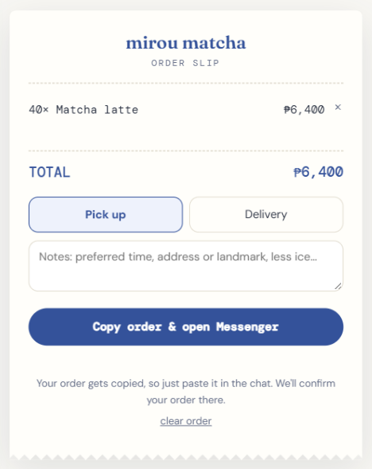 |  |

**Root cause:** there were three separate limits. The quantity buttons stopped at 20 and the saved order was cut to 20 when loaded, but adding to an existing line had **no** limit.

**Fix:** one setting, `MAX_QTY = 20`, used everywhere. Adding only fills a line up to 20. If something is left over, the slip says *"20 of one drink is the most the order slip takes. For a bigger order, just message us on Messenger ✿"*.

| After: adding 20 twice | After: reloading |
| --- | --- |
| 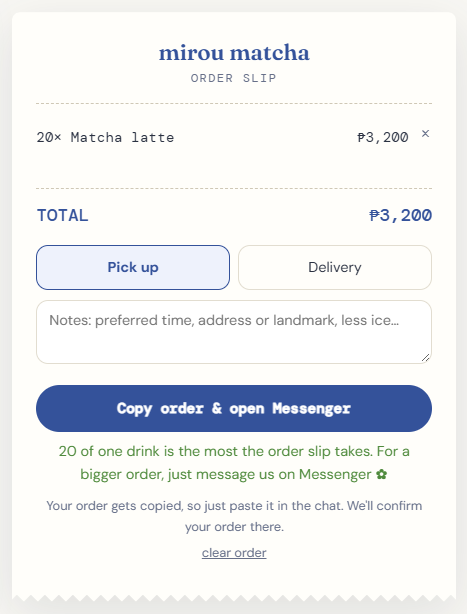 | 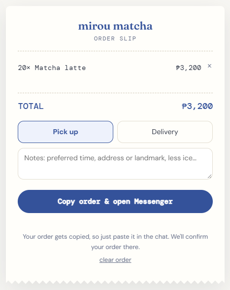 |

**Verification:**
- TC-11 (20 + 20, a full line plus 1, 15 + 10) and TC-14 (reload) pass on desktop, Android and iPhone.
- Both tests **fail on all 3 set-ups** when run against the old code (commit `0558082`).

**Later change (CR-01, 3 Oct 2026):** the owner confirmed she has no limit on order size; the 20 had come with the site's original code. The limit was raised to 99 per drink, only as a guard against typing mistakes, and the message now reads *"The order slip takes up to 99 of each drink. For more, just message us on Messenger ✿"*. The fix above still holds: one setting, used everywhere. TC-11 and TC-14 now test at 99. See [Changes to the requirements](test-plan.md#changes-to-the-requirements).

---

## BUG-003

**On phones, the menu's "Reviews" link lands about 440px short on a first visit**

| | |
| --- | --- |
| Severity / priority | Minor / Medium. The customer lands on the wrong part of the page and has to scroll. |
| Found | 2 Oct 2026, by an automated check of the live site right after it went online |
| Environment | Edge via Playwright, 390 × 844 phone size. Independently reproduced by Dion in Chrome DevTools on an iPhone 16 Pro Max preset (440 × 956). Desktop is not affected. |
| Fixed | 2 Oct 2026, [`c3c66f8`](https://github.com/dionanthonyflores-prog/mirou-matcha/commit/c3c66f8) |
| Status | Closed |

**Steps to reproduce**
1. Open the site fresh on a phone (or a phone-size window), without scrolling first.
2. Tap the **☰ menu** button.
3. Tap **Reviews**.

**Expected:** the page scrolls so "from our mirou besties" sits just under the header.
**Actual:** the page stops on the "in-house delivery" photo. The Reviews heading is about 437px further down.

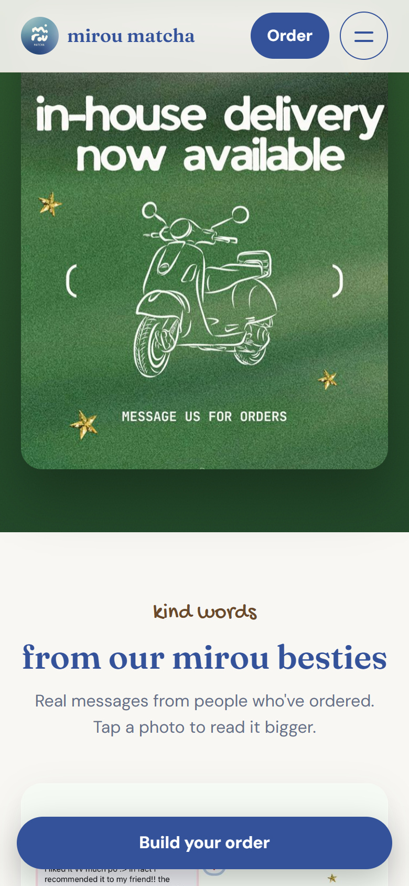

**Root cause:** the delivery photo above the Reviews section loads late (`loading="lazy"`), and the page did not reserve space for it. The scroll reached the right place, then the photo loaded, grew from 0 to 490px tall, and pushed Reviews down. On desktop the photo sits beside the text, so nothing below it moves.

**Fix:** give the photo its real size in the HTML (`width="800" height="1000"`) with `height: auto` in the CSS, so the browser holds a correctly shaped space before the photo arrives.

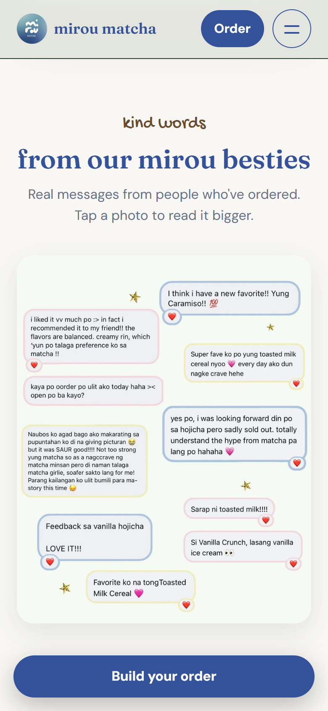

**Verification:**
- TC-36 taps all 5 phone-menu links, each on a fresh page. It waits until the page has stopped moving and the photos have loaded, then checks the section is 58–82px from the top. It passes on Android and iPhone.
- Against the old code, the "Reviews" case **fails on both phones** and the other 4 links pass, which matches the real bug exactly.

---

## BUG-004

**A quick second tap on the menu tabs is ignored**

| | |
| --- | --- |
| Severity / priority | Minor / Medium. The customer has to tap again, which feels broken. It is easy to hit when correcting a wrong tap. |
| Found | 2 Oct 2026, by automated test TC-03 while the test suite was being written |
| Environment | Desktop Chrome and Android (Chromium) every time, when the second tap comes within about 1.5 seconds. Also confirmed on iPhone (WebKit) with a timed check. |
| Fixed | 2 Oct 2026, [`c23eaae`](https://github.com/dionanthonyflores-prog/mirou-matcha/commit/c23eaae) |
| Status | Closed |

**Steps to reproduce**
1. Go to the menu.
2. Tap **hojicha**.
3. Within a second, tap **matcha**.

**Expected:** the menu ends up on matcha.
**Actual:** it stays on hojicha. Three seconds later the hojicha tab is still selected.

| Before (desktop) | Before (phone) |
| --- | --- |
| 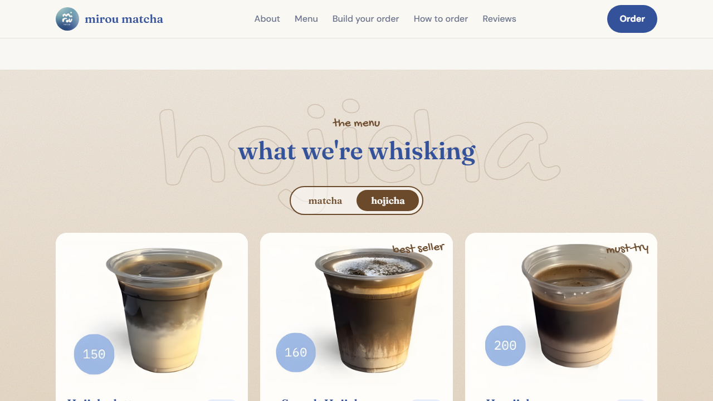 | 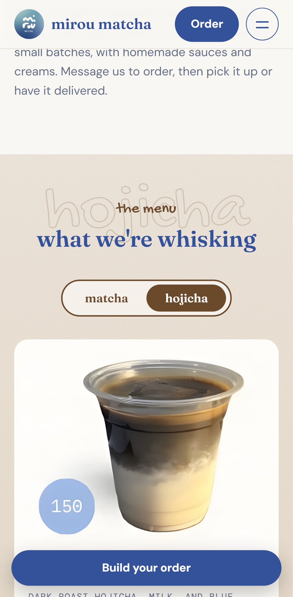 |

**Root cause:** while the cards animate (about 1.8 seconds), a "busy" flag made the tab code **ignore** any new tap, so the second tap was simply lost.

**Fix:** keep the busy flag, because it stops two animations overlapping, but remember the latest tap and carry it out as soon as the animation finishes.

| After (desktop) | After (phone) |
| --- | --- |
| 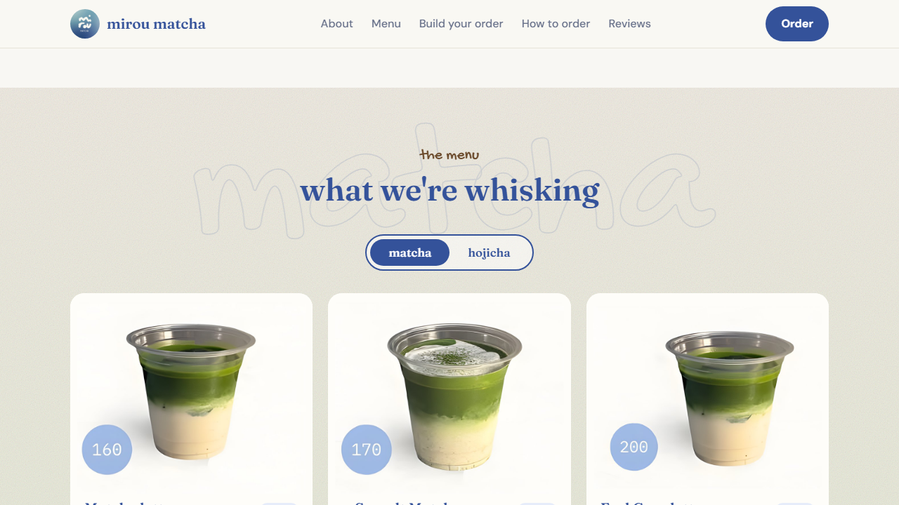 | 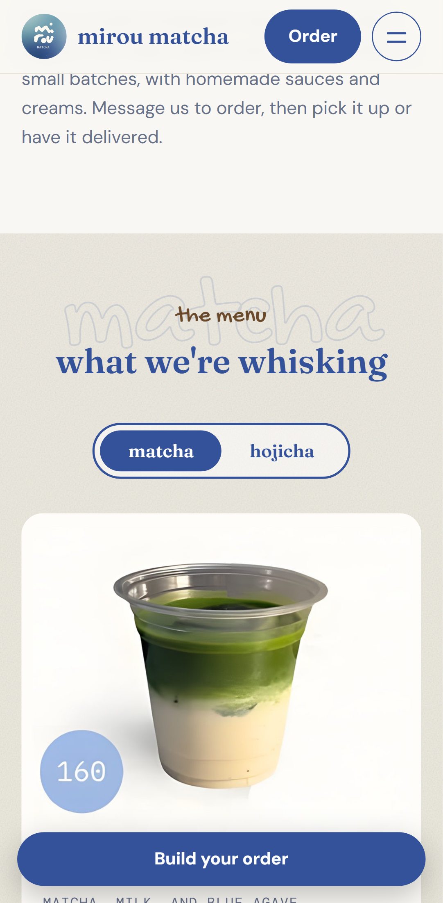 |

**Verification:**
- TC-03 failed on desktop and Android before the fix and passes after.
- A timed check (tap matcha 0.6 s after hojicha, look 3 s later) shows "hojicha" before the fix and "matcha" after, on desktop and phone.

---

## BUG-005

**"clear order" link shows on an empty order slip**

| | |
| --- | --- |
| Severity / priority | Trivial / Low. Tapping it does nothing harmful, but it looks unfinished. |
| Found | 2 Oct 2026, by automated test TC-08 |
| Environment | All 3 set-ups (desktop, Android, iPhone) |
| Fixed | 2 Oct 2026, [`f676ea1`](https://github.com/dionanthonyflores-prog/mirou-matcha/commit/f676ea1) |
| Status | Closed |

**Steps to reproduce:** open the site and look at the order slip before adding anything.
**Expected:** only "no drinks yet", with no "clear order" link.
**Actual:** "clear order" shows under the empty slip.

| Before | After |
| --- | --- |
| 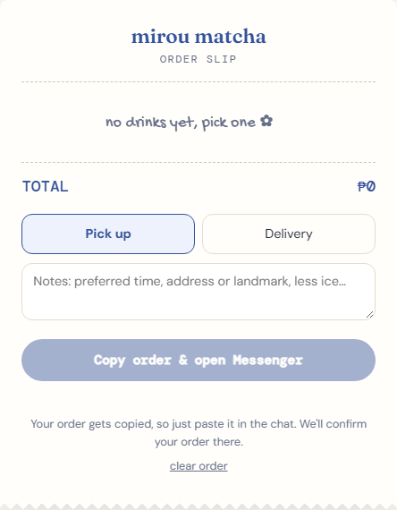 | 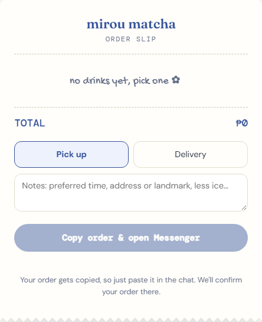 |

**Root cause:** the script hides the link with the HTML `hidden` attribute, but the link's own style (`display: block`) overrides it. The delivery-area box already had a rule to prevent this, and this link did not.

**Fix:** add `.receipt .clear[hidden] { display: none; }`.

**Verification:** TC-08 failed on all 3 set-ups before the fix and passes after.

---

## BUG-006

**On short phone screens the menu cannot be scrolled, so Email is cut off**

| | |
| --- | --- |
| Severity / priority | Minor / High. Customers can't reach the Email card or the last line of the menu. The email address is also in the page footer, so there is a workaround, but this is a popular phone and a customer found it first. |
| Found | 3 Oct 2026, by Dion during a manual check on a Samsung Galaxy S24 Ultra |
| Environment | Phones whose screen is shorter than the open menu. Reproduced on the emulated Android phone at 384 × 700. |
| Fixed | 3 Oct 2026, [`1b1f0ee`](https://github.com/dionanthonyflores-prog/mirou-matcha/commit/1b1f0ee) |
| Status | Closed |

**Steps to reproduce:** on a phone, tap ☰ to open the menu, then swipe up to see the bottom of it.
**Expected:** the menu scrolls, so Email and the "whisked by hand in bay, laguna ✿" line can be seen and tapped.
**Actual:** the menu doesn't move. Email is cut off at the bottom of the screen and the last line can't be seen at all.

| Before: the real phone | Before: after swiping up 3 times | After: after swiping up 3 times |
| --- | --- | --- |
| 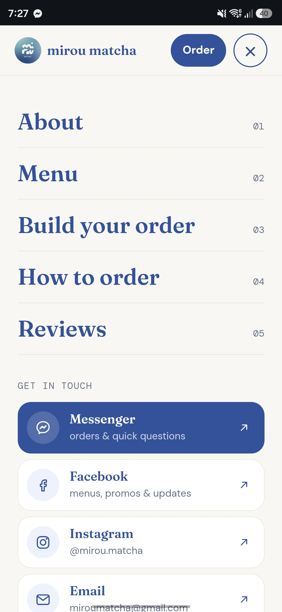 | 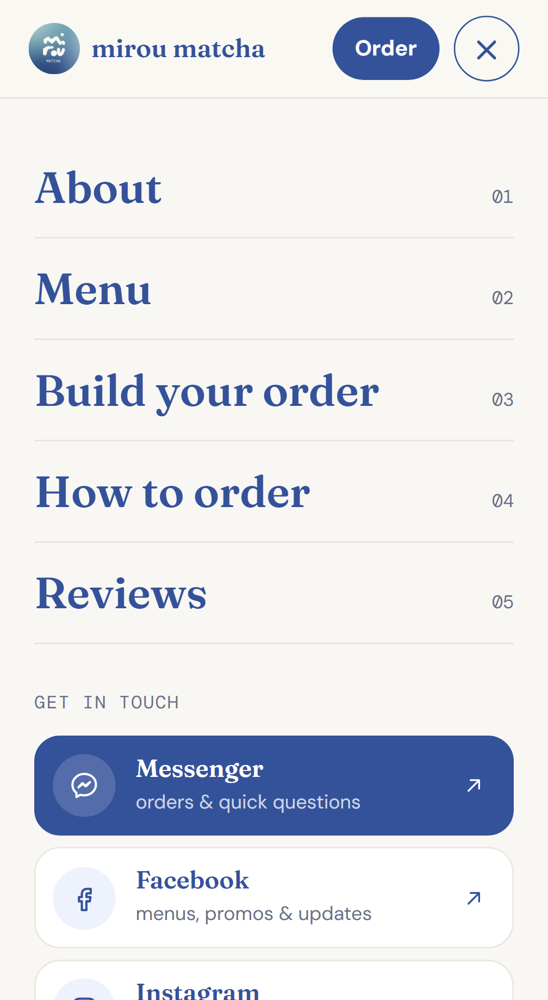 | 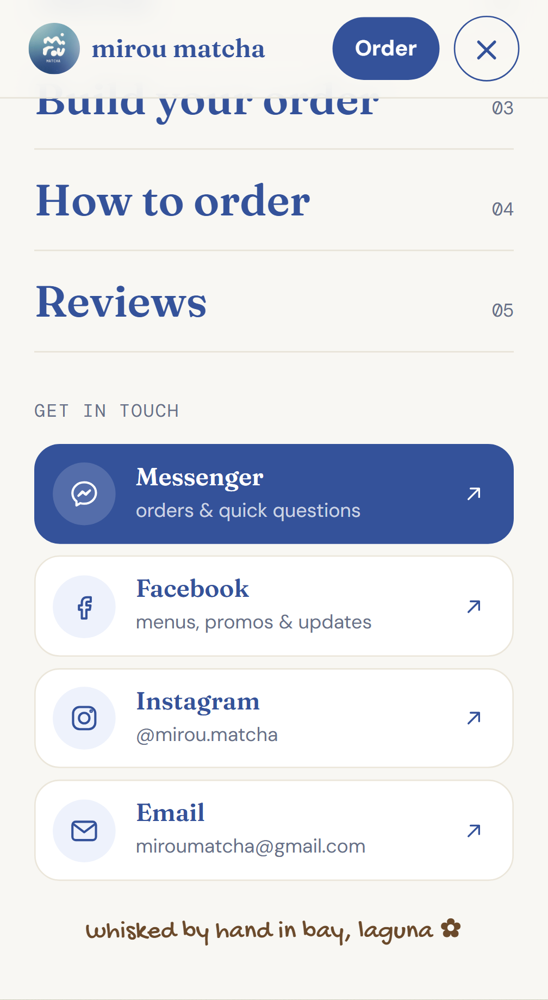 |

**Root cause:** opening the menu pauses the page's smooth-scrolling library (Lenis), so the page behind doesn't move. While paused, Lenis cancels **every** swipe on the page, including swipes inside the menu. The menu was built to scroll by itself when it doesn't fit, but it never got the chance.

**Fix:** mark the menu with `data-lenis-prevent`, so Lenis leaves swipes inside it alone, and add `overscroll-behavior: contain`, so reaching the end of the menu doesn't scroll the page behind it.

**Why the tests missed it:** TC-37 checked that the Email link pointed to the right address, but not that a customer could reach it. TC-37 now opens the menu on a 384 × 700 screen, swipes up with a finger, and checks that Email and the last line are fully on screen while the page behind stays still.

**Verification:** TC-37 failed on the emulated Android phone before the fix ("viewport ratio 0" for Email) and passes after, 5 times in a row. WebKit can't simulate a finger swipe, so on iPhone this is part of manual test MT-03. After the release, Dion retested on the Galaxy S24 Ultra where it was found: the menu scrolls to the bottom.

---

## BUG-007

**With the phone menu open, "Order" and the logo in the header do nothing**

| | |
| --- | --- |
| Severity / priority | Minor / Medium. The customer has to close the menu first, then tap again. |
| Found | 3 Oct 2026, by Dion during the same manual check on a Galaxy S24 Ultra |
| Environment | Phones (Android and iPhone) |
| Fixed | 3 Oct 2026, [`1b1f0ee`](https://github.com/dionanthonyflores-prog/mirou-matcha/commit/1b1f0ee) |
| Status | Closed |

**Steps to reproduce:** on a phone, tap ☰ to open the menu, then tap **Order** in the header.
**Expected:** the menu closes and the page goes to "build your order", like the menu's own "Build your order" link.
**Actual:** nothing happens. The menu stays open.

| Before: after tapping Order | After: after tapping Order |
| --- | --- |
| 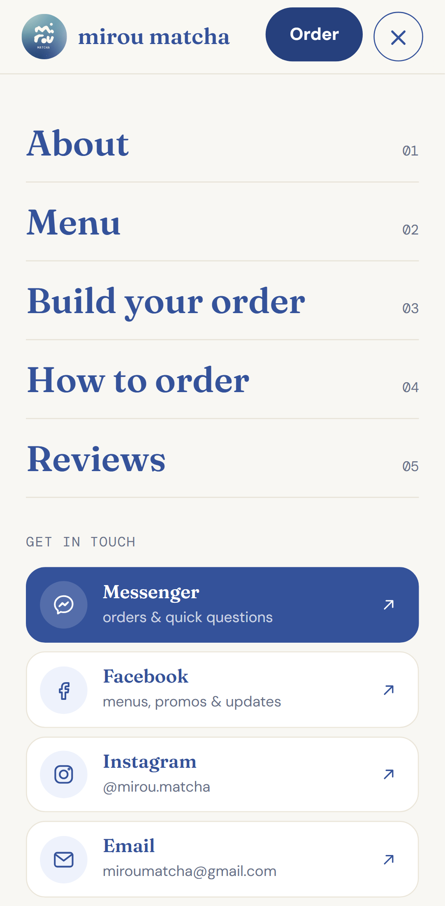 | 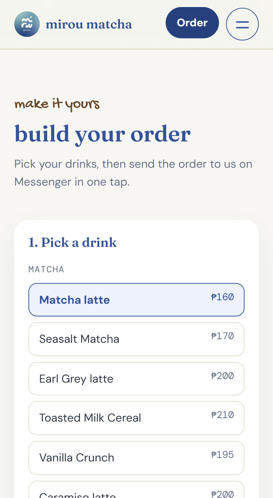 |

**Root cause:** the same paused smooth-scrolling library as BUG-006. It handles links that jump within the page, and while paused it ignores them, so neither the menu nor the page changed.

**Fix:** the header's in-page links (the logo and "Order") close the menu first, which restarts smooth scrolling before it handles the link.

**Verification:** TC-34 now also taps "Order" and the logo with the menu open. It failed on Android and iPhone before the fix and passes after, 5 times in a row on each. After the release, Dion retested on the Galaxy S24 Ultra: Order and the logo close the menu and go to the right place.

---

## Investigated, not a bug

Not every failing test means the product is broken. These failures were investigated and turned out to be problems with the test or the test tools. In each case the test was fixed, not the site.

| What failed | What was found | What was done |
| --- | --- | --- |
| 4 hojicha photos "not loaded" (first live check) | They are lazy-loaded behind the hojicha tab and load as soon as the tab is opened. That is correct behaviour. | The check now opens the tab and scrolls to each photo (TC-49). |
| Swipe test on phones (TC-47) | A *mouse* drag starts the browser's "drag this image" action, which cancels the swipe. A simulated *finger* swipe works: next photo, then previous, and the viewer stays open. | The test now uses a real touch swipe in Chromium. iPhone swiping moved to manual test MT-03, because WebKit can't simulate it. |
| "+ order this" landed in the wrong place (TC-05), only sometimes, and on GitHub's first run on desktop and Android | Studied with the recording and video from GitHub's run, then reproduced locally with frame-by-frame logging. When Playwright taps a card that is still fading or sliding in, it waits, re-checks and **re-scrolls the page by itself**, sometimes several times. The smooth-scrolling library (Lenis) can miss those sudden synthetic jumps, so it calculates the glide from an out-of-date position and overshoots, by exactly the size of the jump (351px on GitHub, 689px locally). Customer-style scrolling (mouse wheel, finger, Home key) landed exactly right 10 out of 10 times, and the page never moved by itself in 40 runs without Playwright tapping. | The test now scrolls through the site's own smooth scroller like a customer's swipe, waits for each card to settle before tapping, and checks that the page moved down to the order builder. The exact landing spot is checked by TC-36 and TC-40, which use links in the fixed header and phone menu and don't hit this. 18/18 repeat runs passed. |
| Copied order text did not match (TC-22) | The test read the order before the "flying cup" animation had finished. Windows also stores copied line breaks differently. | The test waits for the slip to update and ignores the line-break difference. |
| iPhone tests timed out | The iPhone browser engine (WebKit) takes about 1.2 seconds per click when run on Windows, versus 0.12 seconds for Chrome. That is the test engine, not the site. | The iPhone set-up gets a longer time limit. |
| A menu photo "not loaded" on iPhone (TC-49), flaky on GitHub | The test raced down the whole page and then checked every photo at once. Safari's engine may postpone a lazy photo that only flashed past until it is on screen again. That is correct behaviour for a lazy photo. | The test now scrolls past each photo slowly, like a person, and looks again at any photo still missing. It passed 3 times on each set-up. |
| TC-14 timed out on desktop (found by Dion during an independent run) | The trace showed the site working correctly (first drink on the slip, ₱440). The test was still pressing + when its 30-second limit ran out. It needs about 27 taps with real animations, and it was already using 81% of the limit on a quiet computer, so a busier one tipped it over. | TC-14 is marked as a slow test, and the default limit was raised to 60 seconds. On the next full run the closest test used 56% of its limit. (Since CR-01 the test types the quantity instead of tapping, and needs well under half its limit.) |
| 25 seconds before anything showed, on "Slow 4G" (MT-06 measurement) | Broken down by phase, the time was almost all **connecting**: 21.4 s, and the same 21.4 s **with no throttling at all**. 21 s is how long Windows waits before giving up on one kind of connection (IPv6) and trying another, so the delay came from the test computer's network, not the site. Dion's real phone on slow mobile data never showed it. | Re-measured with the connection opened first: first content 1.5 s after connecting, layout shift 0.042. Recorded under MT-06. |
| Radio buttons could not be "checked" | The real radio buttons are hidden behind pill-shaped labels by design. Customers tap the label. | Tests tap the label, like a customer, then confirm the choice took. |
